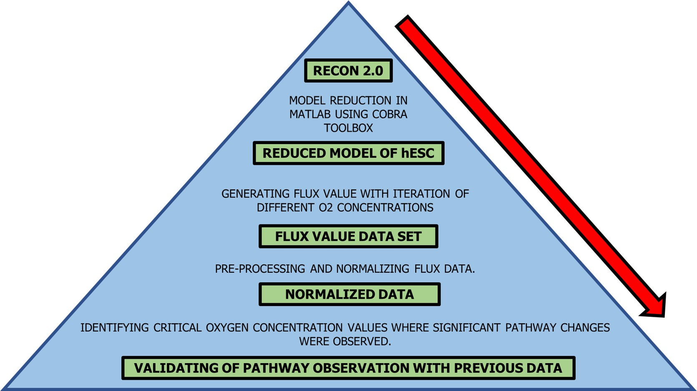
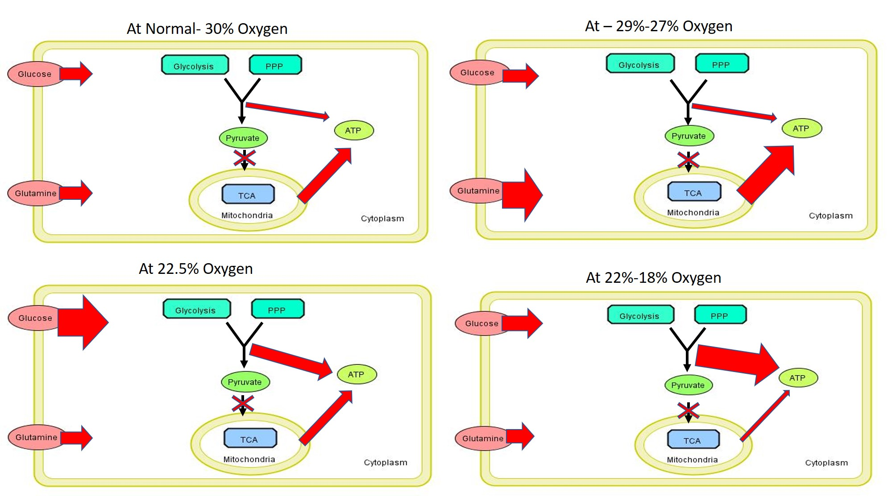
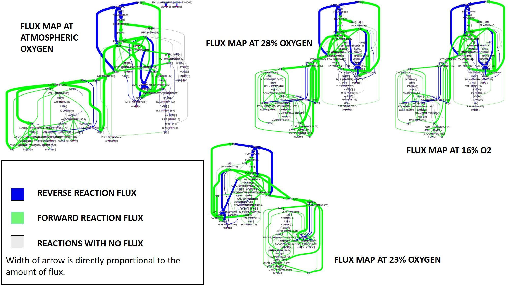

# PluriMetNet
A dynamic electronic model deciphering the metabolic profiling of human embryonic stem cells (hESCs) and its applications

 
## DEFs

* DIR:Reduction_schema || Supplementary 1: An excel sheet of model Specifications for reduction. (.XLSX)
*	DIR:Model            || Supplementary 2: PluriMetNet model in MATLAB file format. (.mat)
*	DIR:Output_flux      || Supplementary 3: A MATLAB script to extract flux values in a linear manner from given range. (.m)
*	DIR:Output_flux      || Supplementary 4: An excel sheet of normalized flux values of all reactions. (.XLSX)
*	DIR:Output_flux      || Supplementary 5: An excel sheet of normalized flux values of all pathways. (.XLSX)
*	DIR:Model_profile    || Supplementary 6: A list of reactions used with abbreviations and equations. (.PDF)

## 3D Plots
3D-Visualization of Flux values: [Click here](https://samuel-bharti.github.io/PluriMetNet/)

## Base

* Parent Model => Recon 2
* Construction Method => Elimination
* Env. => MATLAB
* Tool => COBRA Toolbox

## Metabolic Effect

## Flux Flow

